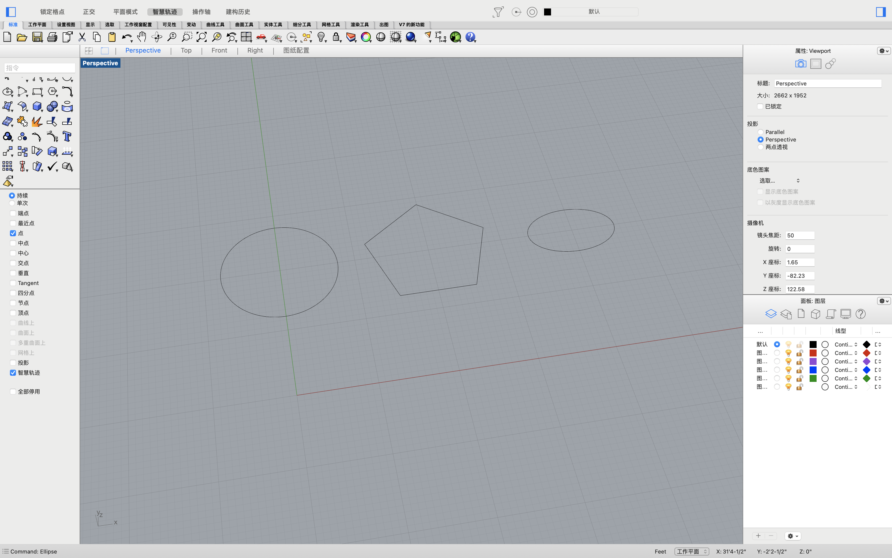
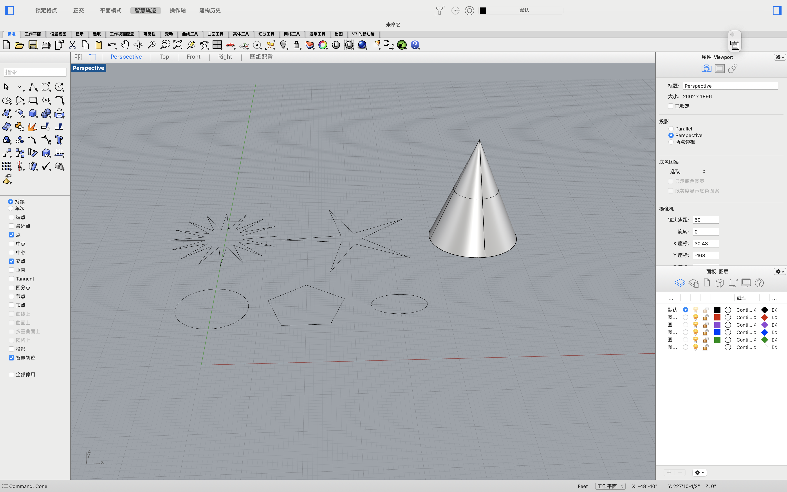
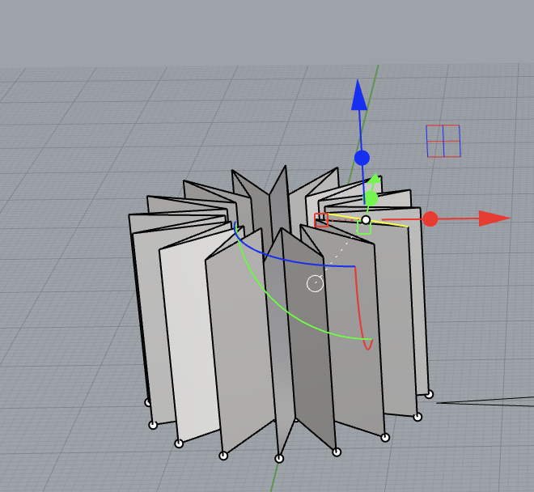
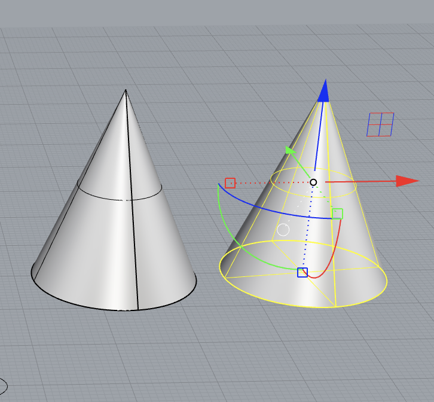
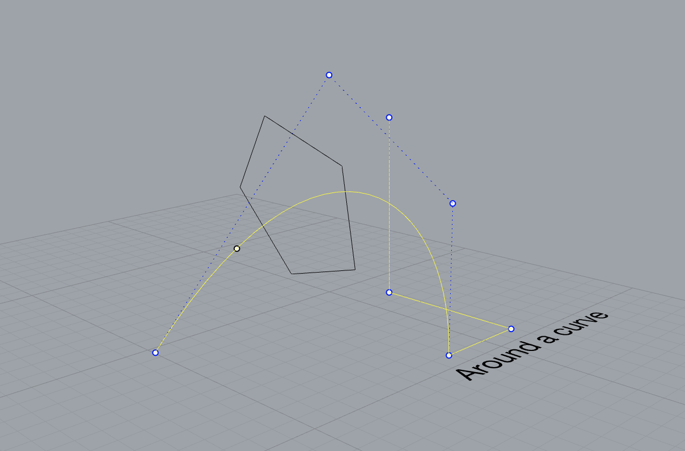
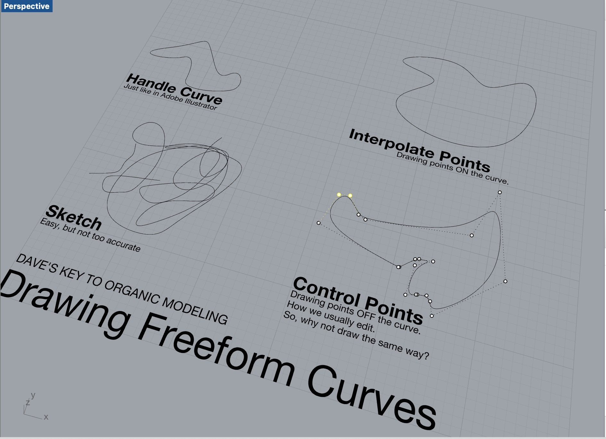
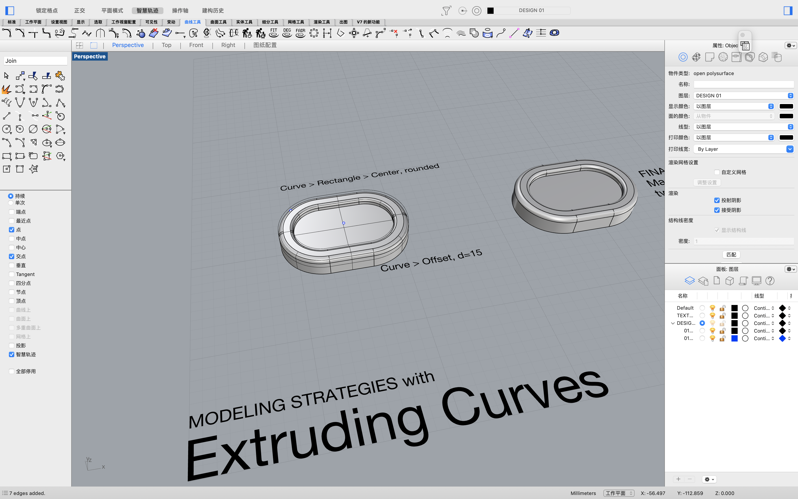
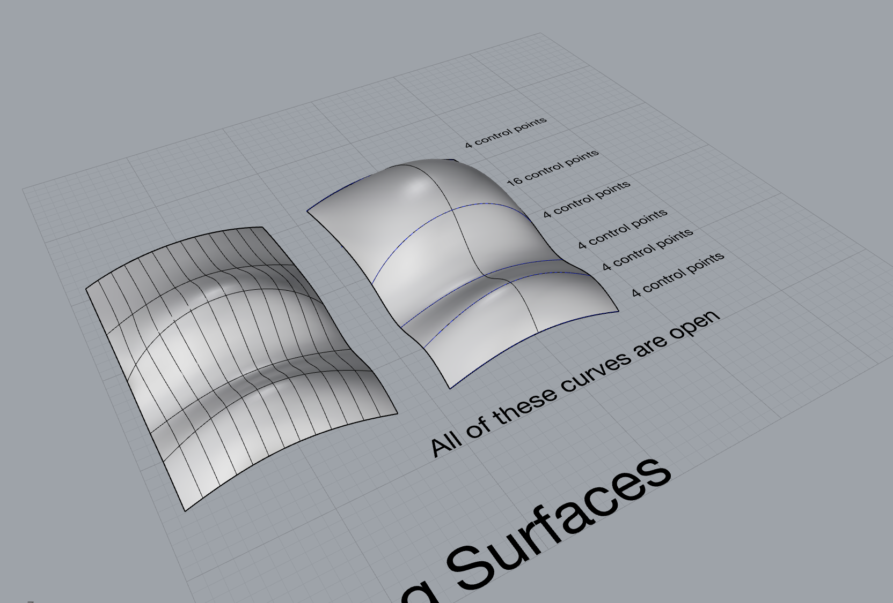
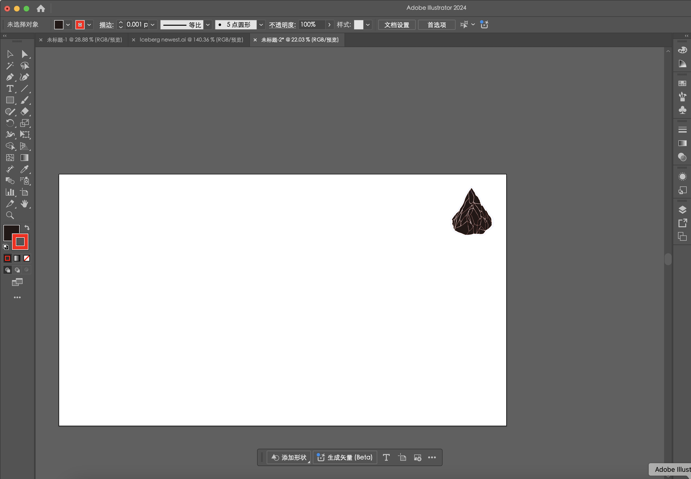
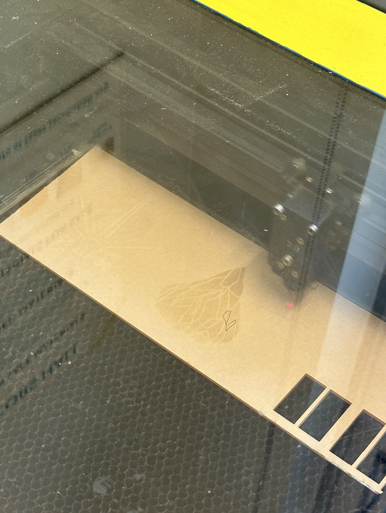

# Week 2: Report 2

Week of 09/12/2024

### 1.Make diagrams of the example files shared.

Last week, I learned some basic knowledge of Rhino modeling. This week, by learning the principles of Grasshopper in class, I began to try using Grasshopper and Rhino together.

The first basic step I learned was how to import a model from Rhino into Grasshopper. I know this might seem a bit silly, but for a beginner, that's how it is.

[Image]

Then, I started trying to build something simple in Grasshopper to make some preliminary changes to the model, such as rotating the model in Grasshopper:

[Image]

And moving it:

[Image]

Trying shear and bend:

[Image]

[Image]

After that, I wanted to try extruding the model in Grasshopper, but I found that it didn’t work as I expected:

[Video]

I asked ChatGPT why I couldn't use extrude on this model, and ChatGPT's answer was that extrude is used on surfaces, with the x, y, and z axes defining the direction of thickness. But this phone stand is a 3D model, so extrude cannot be used to thicken it.

So I switched to another method by setting the surface of the model as a mesh and then connecting amplitude to adjust the thickness.

[Image]

[Video]

Through my initial exploration of Grasshopper and Rhino, I discovered some basic principles of Grasshopper, so I created a diagram to explain my understanding of these principles. Although it’s not very comprehensive, it summarizes my attempts.

### 2. Experiment with the files shared, manipulate the parameters and ‘[bake](https://hopific.com/how-to-bake-in-grasshopper/)’ some forms.

After opening the 3dm and gh files of the phone stand, I began experimenting with adjusting some parameters to figure out what changes correspond to each value and to determine the shape I wanted.

I first experimented with changing the parameters of the phone:

[Video123]

[Video]

[Video]

Then I tried changing the parameters of the phone stand:

[Video123]

[Video]

[Video]

[Screenshot]

By adjusting the parameters of the phone stand, I "designed" three different phone stand models and baked them out.

[Image]

[Image]

[Image]

[Image]

[Image]

[Bake Video]

The fact that multiple designs can be made by adjusting the parameters makes me feel that Grasshopper can bring more possibilities to modeling.

### 3. Experiment with generating your own basic model of a form using Grasshopper.

After learning and exploring Grasshopper for the first time, I tried to create a model myself. I haven’t fully learned how to replace the spheres in the model with other geometric shapes, but I tried using Boolean operations to combine two geometric shapes to create a model.

I first created a box:

[Image]

Then I created a sphere and changed its position so that part of it overlaps with the box:

[Image]

[Image]

I first tried using solid difference and baked two models.

[Image]

[Image]

Next, I tried to create a phone stand by adding a groove to place the phone. My idea was to create a slightly tilted box that overlaps with the model and then use solid difference. But I found that I couldn’t tilt the box along one edge. I asked ChatGPT, created a deconstruct brep, connected it to a list item, and locked the axis of rotation on that edge, but I still couldn’t rotate it.

[Image]

ChatGPT suggested converting the axis of rotation into a point, so I used division to lock the rotation point, but it still didn’t work.

[Image]

[Image]

So, I gave up. I decided not to tilt the box and just add the groove directly to the model. But I failed again because solid difference only has two inputs, which means I can only connect two breps, while I wanted to connect the sphere, the box, and then carve out the groove.

[Image]

I asked ChatGPT again for help and learned a new component—merge. I merged the sphere with the box that had the groove carved out and then used solid union.

[Image]

Bake time!

[Image]

[Bake Video]

Here is the complete form I added:

[Image]

Final product:

[Image]

I know my model is simple, and I encountered many difficulties that I couldn’t solve by myself during the assignment. But by watching some YouTube tutorials and asking ChatGPT for better solutions, I began to gradually understand how Grasshopper assists Rhino. It allows for more flexible and convenient changes to models in Rhino. I hope I can use Grasshopper more proficiently in the future to create the models I want.

---

# Week 1: Report 1

## Week of 09/05/2024

This week, as someone who has never used Rhino before, I downloaded Rhino and started to learn how to use it. I took Dave Schultze's Rhino 7 Essential Training course on LinkedIn to learn some basics about Rhino.
I familiarized myself with Rhino's user interface and navigation tools, and then further started experimenting with some simple 2D and 3D graphics.

On top of that, learn some tranformation tools like move, rotate, etc.

I also explored some knowledge about curves, such as creating 2D graphics on curves

Also the use of freeform

Immediately after that, I learned about some basic surface modeling.
For example, modeling strategies with extruding curves

This is the first time I've created a 3D model with two shapes, and it was a lot of fun!
I also learned lofting surfaces

That's just part of what I'm learning. I think Rhino is a great software to explore. I come from a fashion design background, and during my undergraduate years I learned to use clo3d to model clothing. In the process of learning Rhino, I have discovered that the two softwares have some things in common, but Rhino is more widely used and has more attention to detail. I will keep learning some new Rhino skills every week and train more until I am proficient in this software.

Also I tried laser cut today! Though everything didn't go as smooth as I think (the machine I reserved was out of order and the maker pass didn't go through that quick), I still made it! 

# Hello DES INV 202 Student!
Welcome to your new GitHub repository! 

# Outline
[week 1](README.md#week-1-example-report-1)

week 2, etc...

---

# Github Background Information & Context
If you’re new to GitHub, you can think of this as a shared file space (like a Google Drive folder, or a like a USB drive that’s hosted online.) 

This is your space to store project files, videos, PDFs, notes, images, etc., and (hopefully, neatly) organize so it's easy for viewers (and you!) to navigate. That said, it’s super easy for you to share any file or folder with us (your TDF instructional team) - just send us the link!  As a start, feel free to simply add images to the `/assets` folder, which is located [here](/assets). 

The specific file that I’m typing into right now is the **README.md** for this repo. 
##### (💡 TIP: The .md indicates that we’re using [Markdown formatting.](https://www.markdownguide.org/cheat-sheet/)) #####
<h6> (💡 TIP 2: GitHub Markdown supports <a href="https://gist.github.com/seanh/13a93686bf4c2cb16e658b3cf96807f2"> <em>HTML formatting</em> too, including emojis 😄</a>, in case that helps!) </h6>

### :star: Whatever you write in your **README.md** will show up on the “front page” of your GitHub repo. This is where we’ll be looking for your [weekly progress reports](https://github.com/Berkeley-MDes/24f-desinv-202/wiki/3.0-Weekly-Submissions#weekly-progress-report). They might look something like this: ###

# Week 1: Example Report 1 #
## Week of 09/05/2024

This week, I designed a cool phone stand made of rocks. Check out all my cool sketches and progress photos from this week below, etc., etc....

---

It's time to start making this space your own! If you want to save these instructions, make a copy.  Also, feel empowered to delete everything in this README.md and start documenting! 

Excited to work with you,
your TDF teaching team

PS: let us know if you have any questions!!

PPS: 

## Quick Links, compiled here for your convenience: ##

- [TDF Wiki](https://github.com/Berkeley-MDes/24f-desinv-202/wiki) - the ultimate source for truth and information about the course and assignments
- [Google Drive Folder](https://drive.google.com/drive/u/0/folders/1DJ1b6sSDwHXX6NRcQYt10ivyQSgU0ND6) - slides and other resources
- [bCourses](https://bcourses.berkeley.edu/courses/1537533) - where the grading happens
