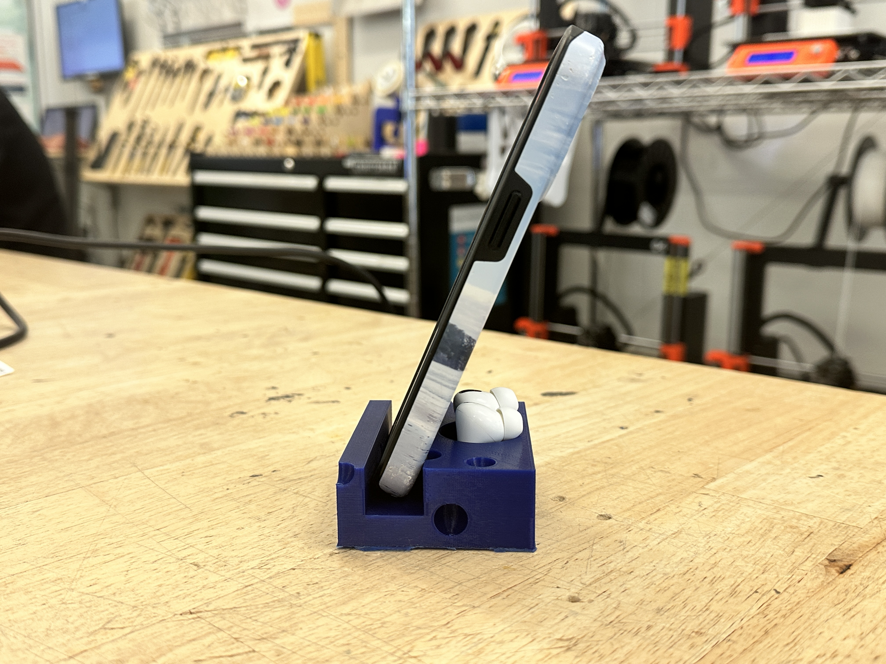

# Week 9: Report 9

## Week of 10/31/2024

This week, I explored how different configurations on ZeroWidth can help GPT answer questions more accurately about my background and work experience. I ran four experiments, each testing various combinations of prompts, RAG (Retrieval-Augmented Generation), and context variables. Here’s a breakdown of each experiment and what I observed.

### Experiment 1: GPT

I started with a simple setup, using a Conversational Input and a Number Slider to control response length. This experiment was mainly about getting familiar with ZeroWidth’s basic components and testing how much customization I could do with just a few settings.

**Related Images**:

Basic setup with input and slider.


Initial greeting and question prompts for testing.


### Experiment 2: **GPT+Instruction**

In the second experiment, I added more detailed instructions in the prompt to guide GPT's responses to better align with my design and education background. The aim was to make the answers feel more tailored to my experiences, and the added details in the prompt seemed to improve relevance.

**Related Images**:

Prompt with detailed instructions.


Example responses with different prompt levels.


### Experiment 3: **GPT+Intruction+RAG**

For the third experiment, I introduced RAG to let GPT pull info directly from my résumé, hoping to get more specific answers. Adjusting the Similarity Threshold in RAG showed some interesting results. Lower thresholds gave broader answers, while higher ones focused more on specific information. This was particularly noticeable in responses to questions like “Did Dianer work at Alexander Wang?”

Threshold adjustments.


Example responses using RAG for the Alexander Wang question.


### Experiment 4: **GPT+INSTRUCT+RAG+VARIABLE**

In the final experiment, I went for a comprehensive setup using Location and Year variables along with INSTRUCT and RAG. I tested this with Postman to simulate different locations and years, which allowed GPT to provide contextually relevant answers based on variables like “New York” and “2023.” This setup really helped in creating more dynamic responses.

**Related Images**:

Testing with LOCATION and YEAR.


Responses across different years and locations, plus final configuration.


### Speculation & Reflection

This week’s experiments showed how powerful it can be to combine prompts, RAG, and variables for more tailored answers. Adjusting the Similarity Threshold is especially useful for balancing between specific and general responses. Moving forward, adding more context variables (e.g., specific projects or skills) could make GPT even more responsive to unique details in my background.

This report, along with the images, captures my progress and insights from each experiment. Excited to keep refining the setup!

# Week 8: Report 8

## Week of 10/24/2024

This week, I continued working on Project 2, focusing on achieving our goals using the Photon device.

Initially, I was testing the functionality of the vibrator. After Selina successfully set up and tested the LED circuit and code, I began working on integrating the vibrator and LED together, combining our codes to make the LED and vibrator function simultaneously. The result was: pressing the button once caused the green LED to flash once and the vibrator to vibrate once; pressing the button twice caused the yellow LED to flash twice and the vibrator to vibrate twice; pressing the button three or more times caused the red LED to flash ten times and the vibrator to vibrate ten times.


***Click & Watch the video:***

[](https://youtu.be/z4Sgi6k03Hc)

Afterward, I researched how to form a group in Particle and set up communication and data transmission. We successfully transmitted accelerometer data.

***Click & Watch the video:***

[](https://youtu.be/_5fk__s5YHY)

We also achieved functionality where Selina's button press triggered the LED and vibrator on my side, using the publish and subscribe methods in our code.

**Publisher Code:**

```

#include "Particle.h"

// Define pins for button, RGB LED, and vibrator
const int buttonPin = D6;
const int redPin = D3;
const int greenPin = D4;
const int bluePin = D5;
const int vibrationMotorPin = D7;  // 振动马达引脚

// Variables to track button presses
volatile int pressCount = 0;
unsigned long lastPressTime = 0;  // To track time between presses
const unsigned long pressDelay = 700;  // 增加按压的时间延迟，避免误判

// Function prototypes
void buttonPressISR();
void turnOffLED();
void publishButtonPress(int count);

void setup() {
// Initialize serial monitor for debugging
Serial.begin(9600);
// Initialize button pin
pinMode(buttonPin, INPUT);
attachInterrupt(buttonPin, buttonPressISR, RISING);  // Interrupt on rising edge for button press

// Initialize RGB LED pins
pinMode(redPin, OUTPUT);
pinMode(greenPin, OUTPUT);
pinMode(bluePin, OUTPUT);

// Initialize vibrator pin
pinMode(vibrationMotorPin, OUTPUT);

// Start with LEDs and vibrator off
turnOffLED();
digitalWrite(vibrationMotorPin, LOW);
}

void loop() {
// Check if press count should be evaluated
if (pressCount > 0 && (millis() - lastPressTime > pressDelay)) {
// 打印当前的按键次数，帮助调试
Serial.print("Press count: ");
Serial.println(pressCount);
    // Publish the press count to the Particle Cloud
    publishButtonPress(pressCount);

    pressCount = 0;  // Reset press count
}
}

// Interrupt Service Routine (ISR) for button press
void buttonPressISR() {
// 增加消抖时间来避免误识别
if (millis() - lastPressTime > pressDelay) {
pressCount = 0;  // Reset press count if the last press was too long ago
}
pressCount++;  // Increment press count
lastPressTime = millis();  // Update last press time
}

// Function to publish button press count to the Particle Cloud
void publishButtonPress(int count) {
char data[10];
snprintf(data, sizeof(data), "%d", count);  // Convert count to a string
Particle.publish("buttonPress", data, PRIVATE);  // Publish event to cloud
Serial.println("Button press event published.");
}

// Function to turn off all LEDs
void turnOffLED() {
digitalWrite(redPin, LOW);
digitalWrite(greenPin, LOW);
digitalWrite(bluePin, LOW);
}

```

**Subscriber Code:**

```
#include "Particle.h"

// Define pins for RGB LED and vibrator
const int redPin = D3;
const int greenPin = D4;
const int bluePin = D5;
const int vibrationMotorPin = D7;  // 振动马达引脚

// Function prototypes
void eventHandler(const char *event, const char *data);
void turnOffLED();
void blinkGreenAndVibrate(int times);
void blinkYellowAndVibrate(int times);
void blinkRedAndVibrate(int times);

void setup() {
// Initialize serial monitor for debugging
Serial.begin(9600);
// Subscribe to the "buttonPress" event
Particle.subscribe("buttonPress", eventHandler);

// Initialize RGB LED pins
pinMode(redPin, OUTPUT);
pinMode(greenPin, OUTPUT);
pinMode(bluePin, OUTPUT);

// Initialize vibrator pin
pinMode(vibrationMotorPin, OUTPUT);

// Start with LEDs and vibrator off
turnOffLED();
digitalWrite(vibrationMotorPin, LOW);
}

void loop() {
// Nothing needed here; everything is handled in the event handler
}

// Event handler for received button press events
void eventHandler(const char *event, const char *data) {
int pressCount = atoi(data);  // Convert the received data to an integer
Serial.printf("Received press count: %d\n", pressCount);
// 根据按钮按下次数执行相应操作
if (pressCount == 1) {
    blinkGreenAndVibrate(1);  // 按一次，绿灯闪一次，振动一次
} else if (pressCount == 2) {
    blinkYellowAndVibrate(2);  // 按两次，黄灯闪两次，振动两次
} else if (pressCount >= 3) {
    blinkRedAndVibrate(10);  // 按三次及以上，红灯闪十次，振动十次
}
}

// Function to blink green LED and vibrate a specified number of times
void blinkGreenAndVibrate(int times) {
for (int i = 0; i < times; i++) {
digitalWrite(greenPin, HIGH);  // Turn green ON
digitalWrite(vibrationMotorPin, HIGH);  // Turn vibrator ON
delay(500);  // Wait
digitalWrite(greenPin, LOW);  // Turn green OFF
digitalWrite(vibrationMotorPin, LOW);   // Turn vibrator OFF
delay(500);  // Wait
}
}

// Function to blink yellow LED (red + green) and vibrate a specified number of times
void blinkYellowAndVibrate(int times) {
for (int i = 0; i < times; i++) {
digitalWrite(redPin, HIGH);
digitalWrite(greenPin, HIGH);  // Turn yellow ON (red + green)
digitalWrite(vibrationMotorPin, HIGH);  // Turn vibrator ON
delay(500);  // Wait
digitalWrite(redPin, LOW);
digitalWrite(greenPin, LOW);  // Turn yellow OFF
digitalWrite(vibrationMotorPin, LOW);   // Turn vibrator OFF
delay(500);  // Wait
}
}

// Function to blink red LED and vibrate a specified number of times
void blinkRedAndVibrate(int times) {
for (int i = 0; i < times; i++) {
digitalWrite(redPin, HIGH);  // Turn red ON
digitalWrite(vibrationMotorPin, HIGH);  // Turn vibrator ON
delay(500);  // Wait
digitalWrite(redPin, LOW);  // Turn red OFF
digitalWrite(vibrationMotorPin, LOW);   // Turn vibrator OFF
delay(500);  // Wait
}
}

// Function to turn off all LEDs
void turnOffLED() {
digitalWrite(redPin, LOW);
digitalWrite(greenPin, LOW);
digitalWrite(bluePin, LOW);
}

```

***Click & Watch the video:***

[](https://youtu.be/T21SOQhg_h0)

Just when we thought we had achieved our goal, I suddenly realized that, given our project’s mutual nature (where the publisher can become the receiver, and the receiver can become the publisher), we needed to integrate the two roles into a shared code.

I then worked on combining these roles, so that each device could act both as the sender and receiver of data. This allowed us to meet the original goal of mutual communication between the SafePair wearers.

**Final Integrated Code:**

```
#include "Particle.h"

// Define pins for button, RGB LED, and vibrator
const int buttonPin = D6;
const int redPin = D3;
const int greenPin = D4;
const int bluePin = D5;
const int vibrationMotorPin = D7;  // 振动马达引脚

// Variables to track button presses
volatile int pressCount = 0;
unsigned long lastPressTime = 0;  // To track time between presses
const unsigned long pressDelay = 700;  // 增加按压的时间延迟，避免误判

String myDeviceID;  // 记录本设备的ID

// Function prototypes
void buttonPressISR();
void turnOffLED();
void publishButtonPress(int count);
void eventHandler(const char *event, const char *data);
void blinkGreenAndVibrate(int times);
void blinkYellowAndVibrate(int times);
void blinkRedAndVibrate(int times);

void setup() {
// Initialize serial monitor for debugging
Serial.begin(9600);
// Get this device's ID
myDeviceID = Particle.deviceID();  // 获取当前设备的ID
Serial.println("Device ID: " + myDeviceID);  // 输出设备ID用于调试

// Initialize button pin
pinMode(buttonPin, INPUT);
attachInterrupt(buttonPin, buttonPressISR, RISING);  // Interrupt on rising edge for button press

// Initialize RGB LED pins
pinMode(redPin, OUTPUT);
pinMode(greenPin, OUTPUT);
pinMode(bluePin, OUTPUT);

// Initialize vibrator pin
pinMode(vibrationMotorPin, OUTPUT);

// Start with LEDs and vibrator off
turnOffLED();
digitalWrite(vibrationMotorPin, LOW);

// Subscribe to the "buttonPress" event from any device
Particle.subscribe("buttonPress", eventHandler);
}

void loop() {
// Check if press count should be evaluated
if (pressCount > 0 && (millis() - lastPressTime > pressDelay)) {
// 打印当前的按键次数，帮助调试
Serial.print("Press count: ");
Serial.println(pressCount);
    // Publish the press count to the Particle Cloud as a PUBLIC event
    publishButtonPress(pressCount);

    pressCount = 0;  // Reset press count
}
}

// Interrupt Service Routine (ISR) for button press
void buttonPressISR() {
// 增加消抖时间来避免误识别
if (millis() - lastPressTime > pressDelay) {
pressCount = 0;  // Reset press count if the last press was too long ago
}
pressCount++;  // Increment press count
lastPressTime = millis();  // Update last press time
}

// Function to publish button press count to the Particle Cloud
void publishButtonPress(int count) {
char data[64];
snprintf(data, sizeof(data), "%s,%d", myDeviceID.c_str(), count);  // Convert count and deviceID to a string
Particle.publish("buttonPress", data, PUBLIC);  // Publish event to cloud as PUBLIC
Serial.println("Button press event published.");
}

// Event handler for received button press events
void eventHandler(const char *event, const char *data) {
// Extract the device ID and press count from the received data
char senderDeviceID[64];
int pressCount;
sscanf(data, "%[^,],%d", senderDeviceID, &pressCount);  // 解析发送者的设备ID和按键次数
// If the event was published by this device, ignore it
if (String(senderDeviceID) == myDeviceID) {
    Serial.println("Event ignored: It came from this device.");
    return;
}

// 打印接收到的设备ID和按键次数
Serial.printf("Received press count: %d from device: %s\\n", pressCount, senderDeviceID);

// 根据按钮按下次数执行相应操作
if (pressCount == 1) {
    blinkGreenAndVibrate(1);  // 按一次，绿灯闪一次，振动一次
} else if (pressCount == 2) {
    blinkYellowAndVibrate(2);  // 按两次，黄灯闪两次，振动两次
} else if (pressCount >= 3) {
    blinkRedAndVibrate(10);  // 按三次及以上，红灯闪十次，振动十次
}
}

// Function to blink green LED and vibrate a specified number of times
void blinkGreenAndVibrate(int times) {
for (int i = 0; i < times; i++) {
digitalWrite(greenPin, HIGH);  // Turn green ON
digitalWrite(vibrationMotorPin, HIGH);  // Turn vibrator ON
delay(500);  // Wait
digitalWrite(greenPin, LOW);  // Turn green OFF
digitalWrite(vibrationMotorPin, LOW);   // Turn vibrator OFF
delay(500);  // Wait
}
}

// Function to blink yellow LED (red + green) and vibrate a specified number of times
void blinkYellowAndVibrate(int times) {
for (int i = 0; i < times; i++) {
digitalWrite(redPin, HIGH);
digitalWrite(greenPin, HIGH);  // Turn yellow ON (red + green)
digitalWrite(vibrationMotorPin, HIGH);  // Turn vibrator ON
delay(500);  // Wait
digitalWrite(redPin, LOW);
digitalWrite(greenPin, LOW);  // Turn yellow OFF
digitalWrite(vibrationMotorPin, LOW);   // Turn vibrator OFF
delay(500);  // Wait
}
}

// Function to blink red LED and vibrate a specified number of times
void blinkRedAndVibrate(int times) {
for (int i = 0; i < times; i++) {
digitalWrite(redPin, HIGH);  // Turn red ON
digitalWrite(vibrationMotorPin, HIGH);  // Turn vibrator ON
delay(500);  // Wait
digitalWrite(redPin, LOW);  // Turn red OFF
digitalWrite(vibrationMotorPin, LOW);   // Turn vibrator OFF
delay(500);  // Wait
}
}

// Function to turn off all LEDs
void turnOffLED() {
digitalWrite(redPin, LOW);
digitalWrite(greenPin, LOW);
digitalWrite(bluePin, LOW);
}

```

Next, I researched how to implement GPS location sharing when the button was pressed twice or more. I integrated Google Maps API in Particle, modified the code, and finally achieved the desired functionality: when the button is pressed twice (indicating a potential risky environment) or three or more times (indicating danger), GPS location data is sent along with the LED and vibrator signals to the other SafePair wearer.

**GPS Code:**

```
#include "Particle.h"
#include <google-maps-device-locator.h>

// Define pins for button, RGB LED, and vibrator
const int buttonPin = D6;
const int redPin = D3;
const int greenPin = D4;
const int bluePin = D5;
const int vibrationMotorPin = D7;  // 振动马达引脚

// Variables to track button presses
volatile int pressCount = 0;
unsigned long lastPressTime = 0;  // To track time between presses
const unsigned long pressDelay = 700;  // 消抖时间延迟，避免误判

String myDeviceID;  // 记录本设备的ID

GoogleMapsDeviceLocator locator;  // GPS定位器对象

// Function prototypes
void buttonPressISR();
void turnOffLED();
void publishButtonPress(int count);
void publishGPSLocation();
void eventHandler(const char *event, const char *data);
void locationCallback(float lat, float lon, float accuracy);
void blinkGreenAndVibrate(int times);
void blinkYellowAndVibrate(int times);
void blinkRedAndVibrate(int times);

void setup() {
// Initialize serial monitor for debugging
Serial.begin(9600);
// Get this device's ID
myDeviceID = Particle.deviceID();  // 获取当前设备的ID
Serial.println("Device ID: " + myDeviceID);  // 输出设备ID用于调试

// Initialize button pin
pinMode(buttonPin, INPUT);
attachInterrupt(buttonPin, buttonPressISR, RISING);  // 中断检测按钮按下

// Initialize RGB LED pins
pinMode(redPin, OUTPUT);
pinMode(greenPin, OUTPUT);
pinMode(bluePin, OUTPUT);

// Initialize vibrator pin
pinMode(vibrationMotorPin, OUTPUT);

// Start with LEDs and vibrator off
turnOffLED();
digitalWrite(vibrationMotorPin, LOW);

// Subscribe to the "buttonPress" event from any device
Particle.subscribe("buttonPress", eventHandler, MY_DEVICES);

// Initialize GPS locator
locator.withSubscribe(locationCallback);  // 使用GPS定位回调
}

void loop() {
// Check if press count should be evaluated
if (pressCount > 0 && (millis() - lastPressTime > pressDelay)) {
// 打印当前的按键次数，帮助调试
Serial.print("Press count: ");
Serial.println(pressCount);
    // 如果按了两次或者三次及以上，发送GPS位置信息
    if (pressCount >= 2) {
        publishGPSLocation();  // 发送GPS位置
    }

    // 发布按钮按下次数到Particle Cloud
    publishButtonPress(pressCount);

    pressCount = 0;  // Reset press count
}
}

// 中断服务程序，记录按钮按下次数
void buttonPressISR() {
if (millis() - lastPressTime > pressDelay) {
pressCount = 0;  // 如果时间间隔太久，重置按下次数
}
pressCount++;  // 计数增加
lastPressTime = millis();  // 更新上次按下时间
}

// 发布按钮按下次数到Particle Cloud
void publishButtonPress(int count) {
char data[64];
snprintf(data, sizeof(data), "%s,%d", myDeviceID.c_str(), count);  // 格式化数据，包含设备ID和按下次数
Particle.publish("buttonPress", data, PRIVATE);  // 发布私有事件
Serial.println("Button press event published.");
}

// 发布当前设备的GPS位置到Particle Cloud
void publishGPSLocation() {
Serial.println("Requesting GPS location...");
locator.publishLocation();  // 触发位置更新
}

// GPS定位回调函数
void locationCallback(float lat, float lon, float accuracy) {
// 将设备的纬度、经度发布到Particle Cloud
char locationData[64];
snprintf(locationData, sizeof(locationData), "%s,%f,%f,%f", myDeviceID.c_str(), lat, lon, accuracy);
Particle.publish("gpsLocation", locationData, PRIVATE);
Serial.printf("Published GPS location: lat=%f, lon=%f, accuracy=%f\n", lat, lon, accuracy);
}

// 事件处理函数，处理接收到的buttonPress事件和GPS信息
void eventHandler(const char *event, const char *data) {
// 检查是按键事件还是GPS事件
if (String(event) == "buttonPress") {
// 从接收到的数据中提取设备ID和按键次数
char senderDeviceID[64];
int receivedPressCount;
sscanf(data, "%[^,],%d", senderDeviceID, &receivedPressCount);  // 解析发送设备的ID和按键次数
 // 如果事件是由本设备发布的，忽略它
    if (String(senderDeviceID) == myDeviceID) {
        Serial.println("Event ignored: It came from this device.");
        return;
    }

    // 打印接收到的设备ID和按键次数
    Serial.printf("Received press count: %d from device: %s\\n", receivedPressCount, senderDeviceID);

    // 根据接收到的按键次数执行相应操作
    if (receivedPressCount == 1) {
        blinkGreenAndVibrate(1);  // 如果按一次，绿灯闪一次，振动一次
    } else if (receivedPressCount == 2) {
        blinkYellowAndVibrate(2);  // 如果按两次，黄灯闪两次，振动两次
    } else if (receivedPressCount >= 3) {
        blinkRedAndVibrate(10);  // 如果按三次及以上，红灯闪十次，振动十次
    }
} else if (String(event) == "gpsLocation") {
    // 接收并处理GPS信息
    char senderDeviceID[64];
    float lat, lon, accuracy;
    sscanf(data, "%[^,],%f,%f,%f", senderDeviceID, &lat, &lon, &accuracy);  // 解析GPS数据

    // 如果GPS信息是本设备发布的，忽略它
    if (String(senderDeviceID) == myDeviceID) {
        Serial.println("GPS event ignored: It came from this device.");
        return;
    }

    // 打印接收到的GPS数据
    Serial.printf("Received GPS location: lat=%f, lon=%f, accuracy=%f from device: %s\\n", lat, lon, accuracy, senderDeviceID);
}
}

// LED闪烁和振动函数
void blinkGreenAndVibrate(int times) {
for (int i = 0; i < times; i++) {
digitalWrite(greenPin, HIGH);  // 打开绿灯
digitalWrite(vibrationMotorPin, HIGH);  // 打开振动马达
delay(500);
digitalWrite(greenPin, LOW);  // 关闭绿灯
digitalWrite(vibrationMotorPin, LOW);  // 关闭振动马达
delay(500);
}
}

void blinkYellowAndVibrate(int times) {
for (int i = 0; i < times; i++) {
digitalWrite(redPin, HIGH);
digitalWrite(greenPin, HIGH);  // 打开黄灯（红+绿）
digitalWrite(vibrationMotorPin, HIGH);  // 打开振动马达
delay(500);
digitalWrite(redPin, LOW);
digitalWrite(greenPin, LOW);  // 关闭黄灯
digitalWrite(vibrationMotorPin, LOW);  // 关闭振动马达
delay(500);
}
}

void blinkRedAndVibrate(int times) {
for (int i = 0; i < times; i++) {
digitalWrite(redPin, HIGH);  // 打开红灯
digitalWrite(vibrationMotorPin, HIGH);  // 打开振动马达
delay(500);
digitalWrite(redPin, LOW);  // 关闭红灯
digitalWrite(vibrationMotorPin, LOW);  // 关闭振动马达
delay(500);
}
}

// 关闭所有LED灯
void turnOffLED() {
digitalWrite(redPin, LOW);
digitalWrite(greenPin, LOW);
digitalWrite(bluePin, LOW);
}

```

This is a video of our test showing the GPS location being transmitted after pressing the button twice or three times:

***Click & Watch the video:***

[](https://youtu.be/I8CMkM1wRdo)

And here is the test of the LED and vibrator:

***Click & Watch the video:***

[](https://youtu.be/GTYBmNiHcSQ)


Finally, I began researching how to use the accelerometer to detect specific events like a fall. This would solve a special case: if a user were to be attacked from behind or lose consciousness, they wouldn't be able to press the button themselves to alert the other wearer. I researched how the accelerometer could automatically trigger a red LED flash and ten vibrations, while also sending the user’s GPS location when it detected a sudden fall.

**Final Accelerometer Code:**

```
#include "Particle.h"
#include <MPU6050.h>
#include <google-maps-device-locator.h>

// Define pins for button, RGB LED, and vibrator
const int buttonPin = D6;
const int redPin = D3;
const int greenPin = D4;
const int bluePin = D5;
const int vibrationMotorPin = D7;  // 振动马达引脚

// Variables to track button presses and accelerometer readings
volatile int pressCount = 0;
unsigned long lastPressTime = 0;  // To track time between presses
const unsigned long pressDelay = 700;  // 按钮消抖时间延迟

String myDeviceID;  // 记录本设备的ID
GoogleMapsDeviceLocator locator;  // GPS定位器对象

MPU6050 mpu;  // 创建MPU6050对象
bool fallDetected = false;  // 跌倒检测标志

// Function prototypes
void buttonPressISR();
void turnOffLED();
void publishButtonPress(int count);
void publishFallEvent();
void publishGPSLocation();
void eventHandler(const char *event, const char *data);
void locationCallback(float lat, float lon, float accuracy);
void blinkGreenAndVibrate(int times);
void blinkYellowAndVibrate(int times);
void blinkRedAndVibrate(int times);
void checkForFall();

void setup() {
// Initialize serial monitor for debugging
Serial.begin(9600);
// Get this device's ID
myDeviceID = Particle.deviceID();  // 获取当前设备的ID
Serial.println("Device ID: " + myDeviceID);  // 输出设备ID用于调试

// Initialize button pin
pinMode(buttonPin, INPUT);
attachInterrupt(buttonPin, buttonPressISR, RISING);  // 中断检测按钮按下

// Initialize RGB LED pins
pinMode(redPin, OUTPUT);
pinMode(greenPin, OUTPUT);
pinMode(bluePin, OUTPUT);

// Initialize vibrator pin
pinMode(vibrationMotorPin, OUTPUT);

// Start with LEDs and vibrator off
turnOffLED();
digitalWrite(vibrationMotorPin, LOW);

// Subscribe to the "buttonPress" and "fallDetected" events from any device
Particle.subscribe("buttonPress", eventHandler, MY_DEVICES);
Particle.subscribe("fallDetected", eventHandler, MY_DEVICES);

// Initialize GPS locator
locator.withSubscribe(locationCallback);  // 使用GPS定位回调

// Initialize accelerometer (MPU6050)
Wire.begin();
mpu.initialize();
if (!mpu.testConnection()) {
    Serial.println("MPU6050 connection failed!");
    while (1);
} else {
    Serial.println("MPU6050 connected successfully.");
}
}

void loop() {
// 检测按钮按下的次数
if (pressCount > 0 && (millis() - lastPressTime > pressDelay)) {
Serial.print("Press count: ");
Serial.println(pressCount);
    if (pressCount >= 2) {
        publishGPSLocation();  // 按两次或三次时发送GPS位置信息
    }

    publishButtonPress(pressCount);  // 传输按钮按下次数

    pressCount = 0;  // Reset press count
}

// Check for fall detection via accelerometer
checkForFall();  // 检查是否检测到摔倒
}

// 中断服务程序，记录按钮按下次数
void buttonPressISR() {
if (millis() - lastPressTime > pressDelay) {
pressCount = 0;
}
pressCount++;
lastPressTime = millis();
}

// 发布按钮按下次数到Particle Cloud
void publishButtonPress(int count) {
char data[64];
snprintf(data, sizeof(data), "%s,%d", myDeviceID.c_str(), count);
Particle.publish("buttonPress", data, PRIVATE);
Serial.println("Button press event published.");
}

// 发布跌倒事件到Particle Cloud
void publishFallEvent() {
char data[64];
snprintf(data, sizeof(data), "%s,FALL", myDeviceID.c_str());
Particle.publish("fallDetected", data, PRIVATE);
Serial.println("Fall event published.");
}

// 发布当前设备的GPS位置到Particle Cloud
void publishGPSLocation() {
Serial.println("Requesting GPS location...");
locator.publishLocation();
}

// GPS定位回调函数
void locationCallback(float lat, float lon, float accuracy) {
char locationData[64];
snprintf(locationData, sizeof(locationData), "%s,%f,%f,%f", myDeviceID.c_str(), lat, lon, accuracy);
Particle.publish("gpsLocation", locationData, PRIVATE);
Serial.printf("Published GPS location: lat=%f, lon=%f, accuracy=%f\n", lat, lon, accuracy);
}

// 事件处理函数，处理接收到的buttonPress和GPS信息
void eventHandler(const char *event, const char *data) {
char senderDeviceID[64];
int receivedPressCount;
sscanf(data, "%[^,],%d", senderDeviceID, &receivedPressCount);
if (String(senderDeviceID) == myDeviceID) {
    Serial.println("Event ignored: It came from this device.");
    return;
}

if (String(event) == "buttonPress") {
    Serial.printf("Received press count: %d from device: %s\\n", receivedPressCount, senderDeviceID);

    if (receivedPressCount == 1) {
        blinkGreenAndVibrate(1);
    } else if (receivedPressCount == 2) {
        blinkYellowAndVibrate(2);
    } else if (receivedPressCount >= 3) {
        blinkRedAndVibrate(10);
    }
} else if (String(event) == "fallDetected") {
    Serial.printf("Fall detected from device: %s\\n", senderDeviceID);
    blinkRedAndVibrate(10);  // 对方摔倒时，我的设备响应红灯和振动
} else if (String(event) == "gpsLocation") {
    float lat, lon, accuracy;
    sscanf(data, "%[^,],%f,%f,%f", senderDeviceID, &lat, &lon, &accuracy);
    Serial.printf("Received GPS location: lat=%f, lon=%f, accuracy=%f from device: %s\\n", lat, lon, accuracy, senderDeviceID);
}
}

// 检测摔倒事件
void checkForFall() {
int16_t ax, ay, az;
mpu.getAcceleration(&ax, &ay, &az);
if (az < -10000) {  // 假设 Z 轴低于-10000表示摔倒
    if (!fallDetected) {
        fallDetected = true;
        Serial.println("Fall detected!");

        // 不在本设备触发LED和振动，只是发布事件
        publishFallEvent();
        publishGPSLocation();
    }
} else {
    fallDetected = false;  // 如果没有检测到摔倒，重置标志
}

```

This is a video showing how data was transmitted via Particle:

***Click & Watch the video:***

[](https://youtu.be/whb1cYwBvs4)

And here is the test of the vibrator, LED, and accelerometer (to facilitate testing, we made the fall detection zone more sensitive, and we plan to adjust this in the future):

***Click & Watch the video:***

[](https://youtu.be/ZLytj6PKkMY)

Clara is in charge of designing the wearable bracelet’s appearance. Later, we plan to solder the breadboard circuits onto a prototype board to create a more aesthetically pleasing design. We will also consider creating an app to make SafePair more user-friendly, and explore custom PCB designs to make this wearable product lighter, more comfortable, and visually appealing.

# Week 7: Report 7

## Week of 10/17/2024

This week, our group started working on Project 2 together. Our project is called SafePair, mainly focused on safety protection and alerts for women. The basic concept is that when the button is pressed once, the LED lights green once, and the vibrator vibrates once; when pressed twice, the LED flashes yellow twice, and the vibrator vibrates in two pulses with a one-second interval; when pressed three times or more, the LED flashes red ten times, and the vibrator vibrates continuously ten times with a one-second interval. Additionally, it includes GPS tracking and an accelerometer that detects gestures to determine if the user has fallen.
At first, we thought of building the whole system together, so I started by wiring the circuit.


But we quickly realized that this would lead to many issues, so we decided to split it into smaller steps. I was responsible for testing the vibrator and implementing the vibration functionality.
First, I connected the vibrator separately and tested its functionality.

#include "Particle.h"

const int motorPin = D3; // connect vibrator

void setup() {
pinMode(motorPin, OUTPUT); // set motorPin as output
}

void loop() {
digitalWrite(motorPin, HIGH); // turn on vibrator
delay(1000); // Vibrate for 1 second
digitalWrite(motorPin, LOW);  // turn off vibrator
delay(1000); // Pause for 1 second
}

Here is my code, and the video showing the vibrator in action:

***Click & Watch the video:***

[](https://youtu.be/al2H9Px2WHI)

Next, I connected a button and tried to control the vibrator with it to turn it on and off.


***Click & Watch the video:***

[](https://youtu.be/ku9FxEjplGw)

Then I started working on implementing the functionality where pressing the button once makes the vibrator vibrate once; pressing it twice makes the vibrator vibrate twice with a one-second interval, and pressing it three times makes the vibrator continuously vibrate ten times with a one-second interval. I was able to quickly achieve the single and double press functionality.


***Click & Watch the video:***

[](https://youtu.be/-WHGIWc8yzg)

However, when I tried to implement the triple press functionality, our initial expectation was for the vibrator to vibrate continuously. But no matter how I adjusted the code, I found it difficult to achieve that. So we decided to change it to vibrate continuously ten times with a one-second interval when the button is pressed three or more times.


***Click & Watch the video:***

[](https://youtu.be/Sj4WC9rcnw0)

I found that although this functionality worked, it couldn't accurately distinguish between pressing the button twice and pressing it three times, so often when pressing the button three times, the vibrator would only vibrate twice. So I adjusted the code and added more delay time, making the recognition more accurate.


***Click & Watch the video:***

[](https://youtu.be/MgSdRU9eWZQ)

After this, we plan to connect the LED and the vibrator together, integrate the code to allow one button to control both the LED and the vibrator, and test the accelerometer and GPS to complete the circuit connection.

# Week6: Report 6

## Week of 10/10/2024

I have compiled and flashed two Stemma-based sensor projects, focusing on the functionalities of the SparkFun APDS-9960 and MPU6050 sensors. Below are my findings and some possible alterations to experiment further with the firmware.

### Initial Observations:

The demo firmware primarily logs data from the sensors to the serial port, providing basic outputs for proximity values (for the APDS-9960) and accelerometer/gyroscope data (for the MPU6050).

For the APDS-9960, I experimented with three different functions:

**Proximity Detection:**


***Click & Watch the video:***

[](https://youtu.be/TDx1IL7t6QM)


***Click & Watch the video***

[](https://youtu.be/09eRTcK3hXY)


**Color Detection Function:**


***Click & Watch the video:***

[](https://youtu.be/kQVb8vn7fTA)

***Click & Watch the video:***

[](https://youtu.be/hvalschF0Ts)


**Gesture Detection Function:**


***Click & Watch the video:***

[](https://youtu.be/XayLE98En9s)


***Click & Watch the video:***

[](https://youtu.be/rBqov98Y5Hc)


For the MPU6050, I mainly experimented with reading data from the accelerometer sensor:


***Click & Watch the video:***

[](https://youtu.be/1tzydU5YivE)

***Click & Watch the video***

[](https://youtu.be/CMkUa-gAbxs)


### Mapping Sensor Values:

For alterations, I tried to map the proximity sensor values to the brightness of an LED. I edited the code, but it was not functioning as expected—the LED remained either constantly on or off. Below is my code:


I'm not sure what's causing the issue and plan to consult my professors for assistance.

### Smoothing Sensor Values:

I then experimented with using a low-pass filter to smooth out the sensor values.


***Click & Watch the video:***

[](https://youtu.be/agA1QYLsNvc)


As seen, the values became much smoother, with less jitter, which increases accuracy. I imagine that in a real-world application, this approach could be useful for controlling LED brightness, adjusting volume levels, and similar scenarios.

### Constrain Sensor Values:

Next, I tested constraining the data. By adding `constrain()` immediately after reading the proximity value, I ensured that the `prox` value stayed within a specified range.


***Click & Watch the video:***

[](https://youtu.be/uRd_vf61o74)


### Diagram

Based on my trials with the different functionalities of the two sensors, and applying modifications like mapping, smoothing, and constraining the data, I created this diagram:


### Speculation

In the future, I’m excited to explore how these sensors can be integrated into more interactive projects, like gesture-based controls or environmental responses. The challenges with mapping proximity values to LED brightness make me think further optimization could unlock better functionality. I’m also curious how combining the MPU6050 accelerometer with proximity detection might enhance gesture recognition. I’m eager to refine these ideas and apply what I’ve learned.

### Project 2 Proposal

Yingying, Xuechun and I are working on our Project 2, and here is our project [proposal](https://docs.google.com/document/d/1NTrjd6Ivd9DsqQrRy5k4kXpfnqgkJmYc25LHgkNxIuk/edit?usp=sharing).


# Week 5: Report 5

## Week of 10/03/2024

This was my first time using the Photon 2, and I tried to control the LED blinking through code. Here's a summary of what I did:

I started by setting up the circuit according to the image provided in the folder. (While matching it with the code, I noticed an error in the image—specifically, the white wire connected to the LED should be inserted into the D7 pin, not D3. I corrected this when building my circuit.)


After creating a new project in VCS as per the tutorial, I tested the file called `04_make_it_blink`. Once I entered the code and connected my Photon, I compiled and flashed it.


When the code ran, I saw that the LED started blinking. Pressing the button changed the blinking frequency, with the periodicity being a random value between 300 and 1000.

**Click & Watch the video:**

[](https://youtu.be/4ag49ddaypU)

I then tried changing the `periodicity` variable to a range between 100 and 2000.


After reconnecting the circuit, I found that this change didn’t make much difference—just that the blinking frequency changed from a random value between 300-1000 to one between 100-2000.

**Click & Watch the video:**

[](https://youtu.be/6MM1Dsa1wFY)

Next, I wanted to change the circuit. I aimed to add a button to control the entire circuit—pressing the new button would make the LED blink as per the original code, and pressing it again would turn off the LED completely. I connected a new button and resistor, with one side of the button connected to the D3 pin and the other to GND.


Not being too sure about the coding part, I asked ChatGPT to help modify it for me.


But I found that this new button didn’t work as I expected. I kept modifying the circuit, trying different connections, but nothing worked—the newly added button just didn’t do anything. (I also made various attempts to change the wiring, but I didn’t capture all of them; nonetheless, none achieved the desired effect.)


After two hours of attempts, I gave up and decided to ask classmates and the teacher for help during the next class to see where the problem was.

I then moved on to compiling and flashing the next file, `05_make_it_blink_outside`. Following the code, I realized I needed to connect another LED to my circuit, so I added a new LED and resistor, with one side of the LED connected to the resistor (and D3 pin) and the other to GND.


After compiling and flashing the code, I saw that both LEDs blinked simultaneously at the same frequency, with the button controlling the random speed of their blinking.

**Click & Watch the video:**

[](https://youtu.be/YpHS383OWrI)

I then modified the code so that one LED was set to HIGH while the other was set to LOW, and vice versa.


This resulted in the LEDs alternating their blink. The yellow LED (`led_out2`) stayed on longer because, in the modified code, `led_out2` in the HIGH state had no delay control.

**Click & Watch the video:**

[](https://youtu.be/-TpIommmuXk)

I added a delay of 500 milliseconds after `digitalWrite(led_out2, HIGH)`.


With this change, the yellow LED (`led_out2`) stayed on longer due to the 500 milliseconds of delay while it was in the HIGH state, while the green LED (`led_out`) remained on for only 100 milliseconds. As a result, the green LED would light up for 100 milliseconds before turning off, while the yellow LED would stay on for 500 milliseconds before turning off.

**Click & Watch the video:**

[](https://youtu.be/v77Pw_rOwRs)

After this, I moved on to compiling and flashing the third file, `06_publishing_info`. In this file, I mainly observed the constantly updating information in the terminal by typing “particle serial monitor --follow.”

**Click & Watch the video:**

[](https://youtu.be/lKnDGrc5Na0)

Every time I pressed the button, the rate at which the characters were generated would change randomly between 1000 and 2000 milliseconds.

**Click & Watch the video:**

[](https://youtu.be/5Lr92vuwN94)

I then changed the `periodicity` to 500 (I originally intended to change `void change_period(void) { periodicity = random(1000, 2000); }` but instead altered `int periodicity = 2000;`).


With this change, I observed that the LEDs alternated their blinking faster, and the character printing frequency in the terminal also increased.

**Click & Watch the video:**

[](https://youtu.be/q57Cteq_nRA)

**Click & Watch the video:**

[](https://youtu.be/X8qCsSHGWW0)

**Reflection on the Circuit and Coding System**

**How the System Works Together**

While working with the circuit and Particle code, I saw how the parts fit together. The timing system controlled the LED blinking, and the code variables like button_pressed and periodicity influenced behavior — whether the LED flashed or how fast it blinked. Everything — from the circuit to the serial logs and cloud updates — creates a cohesive loop of control and feedback.

**Benefits for New Designs**

This system is flexible and modular, so it’s great for trying out new ideas. Changing the code or adding components like another LED or button was quick, which makes it easier to test new functions. Sending data to the Particle cloud adds real-time monitoring and analysis, which can be helpful for smart devices or interactive projects.

**Entry Points and Advantages**

The main entry points are hardware (building the circuit), software (coding on VCS), and cloud (data logging). The advantage is how seamlessly these work together, letting you build, test, and see results quickly. Compared to other systems, it’s easy to experiment and adjust quickly, while still getting data logged for deeper insights.

**What Ecosystems Are Missing?**

What’s missing in my daily life is a connected system that tracks my work habits and gives instant feedback — something that could monitor my productivity across all devices and suggest changes in real-time, like when to take breaks or turn off distractions.

**Connections to Other Systems**

This circuit system is a lot like my work-productivity ecosystem map. Just like the Particle code uses timers to blink LEDs, my apps send notifications to drive my tasks. A button on the circuit is like clicking "done" in a task app, and the serial logs track progress similar to how a task manager does. Seeing these connections makes me think about how I could use something similar to automate parts of my daily routines, like a hardware button to log time spent on tasks or adjust my work environment.

# Continue on Wednesday

I tried the `03_altering_periodicity` file. I noticed that the circuit diagram shows a four-legged button, but the kit only came with a two-legged button, so I had to connect the circuit myself.


After compiling and flashing, I could see in the serial monitor that every time I pressed the button, the speed at which the characters printed would change. Since the `change_period` function is set between 300-1000 milliseconds, the interval between characters should randomly change within that range.

**Click & Watch the video:**

[](https://youtu.be/6j5zCrBcRgE)

After initially getting familiar with the Photon 2 and VSC (Visual Studio Code), I started trying new circuit connections and new code.

First, I tried the Button-LED pulse rate and connected the circuit according to the diagram.


Every time I pressed the button, I noticed that the LED pulse rate gradually increased. However, once it reached a certain speed, it would return to the initial speed.

**Click & Watch the video:**

[](https://youtu.be/KUbzPDkTwKo)

I then continued with the FSR-LED color circuit, using the FSR to change the LED color. My circuit connection is shown in the image below:


When I pressed the FSR with different amounts of force, the LED color would change. For example, I found that when I lightly pressed the FSR, the LED would be purple, it would turn green with more force, and become blue when pressed very hard.

**Click & Watch the video:**

[](https://youtu.be/gaFPPc5Mpec)

However, the effect might not be very clear in the video, so I also checked the pressure values in the serial monitor to confirm the change.

**Click & Watch the video:**

[](https://youtu.be/ktI1nUK5qLQ)

Lastly, I tried the Potentiometer-OLED. The circuit connection is as shown:


Initially, I kept getting errors in the code. Later, I realized that it was because I hadn't properly added the `Adafruit_GFX` and `Adafruit_SSD1306` libraries from the folder, and I also hadn't included `splash.h` in the `src` directory. Once I set everything up correctly, it finally compiled successfully.


After connecting the circuit, I found that every time I turned the potentiometer, the OLED display would show different potentiometer values.

**Click & Watch the video:**

[](https://youtu.be/doICR3DRXpw)

**Differences:**

1. **Inputs and Outputs**:
    - The prior examples mainly use a button to change things like text print speed and LED flashes.
    - The new demo projects switch it up: a button for LED pulse rate, an FSR to change LED color, and a potentiometer to adjust an OLED display.
2. **Complexity**:
    - The prior examples have simpler outputs (LEDs and serial messages).
    - The new demo projects add more functionality: RGB LEDs with colors changing based on pressure and an OLED display showing variable readings.

**Similarities:**

1. **Input Triggers Changes**: All codes use some input (button, FSR, potentiometer) to alter outputs.
2. **Interrupt Handling**: They all use interrupts to detect changes quickly.
3. **Loop Structures**: Each code runs in a loop, checking for input and updating output.

**Feature Expansion:**

Use data to improve visualization—like sending sensor data (maybe button press count, FSR pressure, potentiometer values) to a phone app via Wi-Fi, showing real-time changes. Also, for the FSR example, adding more color gradients to represent different levels of pressure, making it more visually informative.

**Most Relevant Feature:**

What I’m thinking is a mood-light indicator using FSR for pressure sensing (changing colors) and a potentiometer for brightness control. Users can change the light color by using different pressure to press the FSR, and rotate the potentiometer to change the brightness of the light.

**Machine Learning Role:**

In my system, Machine Learning probably can predict mood based on pressure patterns, associating them with moods or stress levels. Also, based on different behaviors (like how users usually interact with the potentiometer), Machine Learning can learn from the behaviors to make the system more personalized.

**Combined System Idea:**

I think I can combine all the examples into a personal wellness tracker - button to switch modes, FSR for stress sensing (changing LED color), potentiometer for brightness, and OLED showing real-time feedback, insights, or maybe suggestions for users based on the stress levels.

# Week 4: Report 4

## Week of 09/26/2024

For this week, I mainly focused on mapping my daily ecosystem. What I chose is to do a “Work & Productivity Ecosystem” map since I’m familiar with this and it is mainly what I’ve been doing since I started the MDes program. The followoing image is the map I created.


### Description

This ecosystem map centers around the laptop as the primary device for managing work tasks and communication. It illustrates how various platforms, applications and tools—such as task management apps, calendars, cloud storage, collaborative apps, video conferencing, and a mobile phone—are interconnected.

- The laptop serves as the core, where tasks are created, updated, and managed using a task management platform.
- The calendar syncs with the task management platform, updating with deadlines and reminders, which are also accessible on the phone.
- Cloud storage provides a backup for task data and files, making them available across devices and to the collaborative app for team collaboration.
- Video conferencing improves real-time communication and project updates, feeding back into task management and scheduling.

The feedback loops show how tasks, updates, and reminders move  between devices and platforms, enabling real-time collaboration and information sharing. This ecosystem supports productivity, ensuring tasks, deadlines, and team collaboration are organized at the same time.

### Reflections

Mapping my digital ecosystem helped me see how interconnected my daily tools are, particularly how information flows between platforms like cloud storage, task management, and collaborative apps. It showed me how each tool enhances overall productivity.

### Speculations

As AI continues to integrate into daily platforms, I think that there will be smarter management for scheduling, task prioritization, and real-time collaboration. In the future, I’ll probably dive deeper into using the more advanced features of the tools I use now, aiming to automate more tasks and make sure all the platforms work together smoothly.

### Industry Insight

The rise of “Super Apps” like WeChat and Alipay could transform digital ecosystems, integrating services like messaging, payments, and e-commerce into one app, potentially simplifying workflows and changing how we interact with multiple platforms now. In the future, all the platforms and applications that I mapped today may simply just combined into one app, and improve the efficiency of work and study.

[News on “Super Apps”](https://www.boxo.io/blog/most-popular-superapps-in-the-world)

# Week 3: Report 3

## Week of 09/19/2024

### 

This week, I have been working on Project 1.

I created a total of three cellphone stands. In the first cellphone stand design, I mainly built a box and then added several spheres. By adjusting the positions of the spheres to achieve the desired effect, I used Solid Union to combine them and then carved out a groove.

**Click & Watch the video:**

[](https://youtu.be/1ZtOSspVElo)

Next, I used a 3D printer for the first time to print out this model.

**Click & Watch the video:**

[](https://youtu.be/6mWTH9IC5mg)

An interesting aspect of the design process was that I considered user convenience. I created a spherical hole to store earphones and a hollow sphere to allow the charging cable to pass through. However, it became clear that the charging feature did not work well.





**Click & Watch the video:**

[](https://youtu.be/AlHOxf91MsY)

So, I decided to improve the model. Based on feedback from my classmates, I made the following adjustments: I built another box to provide support for the back of the phone; I raised the groove by changing its position along the Z-axis to make it higher, better accommodating the charging cable; I also extended the hole for the charging cable all the way to the bottom to make it easier to use.

I then 3D printed the second cellphone stand.

**Click & Watch the video:**

[](https://youtu.be/NyZJTkdmgEo)

**Click & Watch the video:**

[](https://youtu.be/Vkp2nEFAqgk)

However, I felt the process was becoming repetitive, so I wanted to challenge myself by creating a more complex design. As someone with a design background, I tend not to focus solely on structural complexity, but more on the design itself. I wanted to keep the cheese-inspired design but change the way the stand provides support.

So, I redesigned the stand.


I first built the basic structure of the cellphone stand using three boxes, which I merged using **Solid Union**.

Next, I created a polygon, extruded it to the desired height, moved it to the ideal position, and used Cap Holes to close the geometry. To allow the triangular prism to serve as a support for the stand, I wanted to rotate it along one of its edges. I used List Item to select one edge, then used End Points and Vector 2Pt to convert the edge into an axis, which I connected to Rotate 3D for rotation. After that, I repeated my first design steps, continuously creating spheres and using Solid Difference to carve out the cheese-like shape.

**Click & Watch the video:**

[](https://youtu.be/bUB6-bJzmjM)

To ensure the phone could be properly supported, I had to make sure the cheese was positioned correctly. With the phone case, the phone's thickness is 1.2mm. After multiple measurements, I found a simpler method by using Rhino’s Distance tool to simulate the phone’s placement.


To provide better support for the phone, I added another triangular prism to the top of the cellphone stand (even though I wasn’t sure if it would work). So I created another polygon. However, to meet different support needs, I used Scale NU to adjust the lengths of the polygon’s sides, making it no longer an equilateral triangle. After extruding, rotating, and other operations, I baked the model and performed a Boolean Union in Rhino. This is my final model.


# Week 2: Report 2

## Week of 09/12/2024

### 1.Make diagrams of the example files shared.

Last week, I learned some basic knowledge of Rhino modeling. This week, by learning the principles of Grasshopper in class, I began to try using Grasshopper and Rhino together.

The first basic step I learned was how to import a model from Rhino into Grasshopper. I know this might seem a bit silly, but for a beginner, that's how it is.


Then, I started trying to build something simple in Grasshopper to make some preliminary changes to the model, such as rotating the model in Grasshopper:


And moving it:


Trying shear and bend:


After that, I wanted to try extruding the model in Grasshopper, but I found that it didn’t work as I expected:

**Click & Watch the video:**

[](https://youtu.be/_-SPIFKRiFM)

I asked ChatGPT why I couldn't use extrude on this model, and ChatGPT's answer was that extrude is used on surfaces, with the x, y, and z axes defining the direction of thickness. But this phone stand is a 3D model, so extrude cannot be used to thicken it.

So I switched to another method by setting the surface of the model as a mesh and then connecting amplitude to adjust the thickness.


**Click & Watch the video:**

[](https://youtu.be/RsaaJbQGdVQ)

Through my initial exploration of Grasshopper and Rhino, I discovered some basic principles of Grasshopper, so I created a diagram to explain my understanding of these principles. Although it’s not very comprehensive, it summarizes my attempts.


### 2. Experiment with the files shared, manipulate the parameters and ‘bake’ some forms.

After opening the 3dm and gh files of the phone stand, I began experimenting with adjusting some parameters to figure out what changes correspond to each value and to determine the shape I wanted.

I first experimented with changing the parameters of the phone:

**Click & Watch the video:**

[](https://youtu.be/T2pt9rDimW4)

[](https://youtu.be/2hj6hMg86AQ)

Then I tried changing the parameters of the phone stand:

**Click & Watch the video:**

[](https://youtu.be/UtUWniQJGME)

[](https://youtu.be/-FW1em-v9sc)

[](https://youtu.be/Ql4sGBcGI_c)

[](https://youtu.be/0lNkcZkTMJY)

By adjusting the parameters of the phone stand, I "designed" three different phone stand models and baked them out.


The fact that multiple designs can be made by adjusting the parameters makes me feel that Grasshopper can bring more possibilities to modeling.

### 3. Experiment with generating your own basic model of a form using Grasshopper.

After learning and exploring Grasshopper for the first time, I tried to create a model myself. I haven’t fully learned how to replace the spheres in the model with other geometric shapes, but I tried using Boolean operations to combine two geometric shapes to create a model.

I first created a box:


Then I created a sphere and changed its position so that part of it overlaps with the box:


I first tried using solid difference and baked two models.


Next, I tried to create a phone stand by adding a groove to place the phone. My idea was to create a slightly tilted box that overlaps with the model and then use solid difference. But I found that I couldn’t tilt the box along one edge. I asked ChatGPT, created a deconstruct brep, connected it to a list item, and locked the axis of rotation on that edge, but I still couldn’t rotate it.


ChatGPT suggested converting the axis of rotation into a point, so I used division to lock the rotation point, but it still didn’t work.


So, I gave up. I decided not to tilt the box and just add the groove directly to the model. But I failed again because solid difference only has two inputs, which means I can only connect two breps, while I wanted to connect the sphere, the box, and then carve out the groove.


I asked ChatGPT again for help and learned a new component—merge. I merged the sphere with the box that had the groove carved out and then used solid union.


Bake time!


Here is the complete form I added:


Final product:


I know my model is simple, and I encountered many difficulties that I couldn’t solve by myself during the assignment. But by watching some YouTube tutorials and asking ChatGPT for better solutions, I began to gradually understand how Grasshopper assists Rhino. It allows for more flexible and convenient changes to models in Rhino. I hope I can use Grasshopper more proficiently in the future to create the models I want.

---


# Week 1: Report 1

## Week of 09/05/2024

This week, as someone who has never used Rhino before, I downloaded Rhino and started to learn how to use it. I took Dave Schultze's Rhino 7 Essential Training course on LinkedIn to learn some basics about Rhino.
I familiarized myself with Rhino's user interface and navigation tools, and then further started experimenting with some simple 2D and 3D graphics.


On top of that, learn some tranformation tools like move, rotate, etc.


I also explored some knowledge about curves, such as creating 2D graphics on curves


Also the use of freeform


Immediately after that, I learned about some basic surface modeling.
For example, modeling strategies with extruding curves


This is the first time I've created a 3D model with two shapes, and it was a lot of fun!
I also learned lofting surfaces


That's just part of what I'm learning. I think Rhino is a great software to explore. I come from a fashion design background, and during my undergraduate years I learned to use clo3d to model clothing. In the process of learning Rhino, I have discovered that the two softwares have some things in common, but Rhino is more widely used and has more attention to detail. I will keep learning some new Rhino skills every week and train more until I am proficient in this software.

Also I tried laser cut today! Though everything didn't go as smooth as I think (the machine I reserved was out of order and the maker pass didn't go through that quick), I still made it! 


# Hello DES INV 202 Student!
Welcome to your new GitHub repository! 

# Outline
[week 1](README.md#week-1-example-report-1)

week 2, etc...

---

# Github Background Information & Context
If you’re new to GitHub, you can think of this as a shared file space (like a Google Drive folder, or a like a USB drive that’s hosted online.) 

This is your space to store project files, videos, PDFs, notes, images, etc., and (hopefully, neatly) organize so it's easy for viewers (and you!) to navigate. That said, it’s super easy for you to share any file or folder with us (your TDF instructional team) - just send us the link!  As a start, feel free to simply add images to the `/assets` folder, which is located [here](/assets). 

The specific file that I’m typing into right now is the **README.md** for this repo. 
##### (💡 TIP: The .md indicates that we’re using [Markdown formatting.](https://www.markdownguide.org/cheat-sheet/)) #####
<h6> (💡 TIP 2: GitHub Markdown supports <a href="https://gist.github.com/seanh/13a93686bf4c2cb16e658b3cf96807f2"> <em>HTML formatting</em> too, including emojis 😄</a>, in case that helps!) </h6>

### :star: Whatever you write in your **README.md** will show up on the “front page” of your GitHub repo. This is where we’ll be looking for your [weekly progress reports](https://github.com/Berkeley-MDes/24f-desinv-202/wiki/3.0-Weekly-Submissions#weekly-progress-report). They might look something like this: ###

# Week 1: Example Report 1 #
## Week of 09/05/2024

This week, I designed a cool phone stand made of rocks. Check out all my cool sketches and progress photos from this week below, etc., etc....


---

It's time to start making this space your own! If you want to save these instructions, make a copy.  Also, feel empowered to delete everything in this README.md and start documenting! 

Excited to work with you,
your TDF teaching team

PS: let us know if you have any questions!!

PPS: 

## Quick Links, compiled here for your convenience: ##

- [TDF Wiki](https://github.com/Berkeley-MDes/24f-desinv-202/wiki) - the ultimate source for truth and information about the course and assignments
- [Google Drive Folder](https://drive.google.com/drive/u/0/folders/1DJ1b6sSDwHXX6NRcQYt10ivyQSgU0ND6) - slides and other resources
- [bCourses](https://bcourses.berkeley.edu/courses/1537533) - where the grading happens
